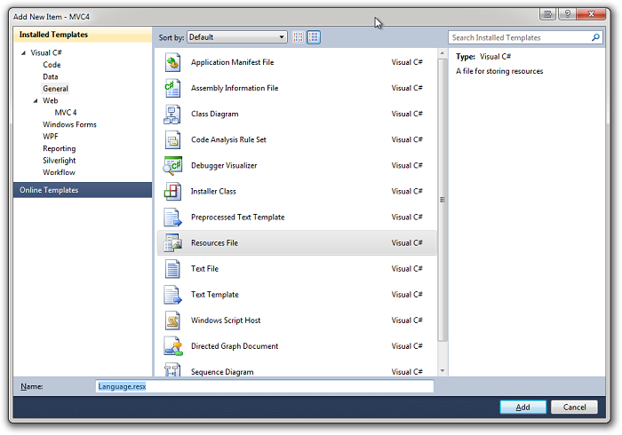

<div id="screenshot" style="float:right">
	
	<div style="clear:both">&nbsp;</div>
</div>

# Add i18n to your site (Razor) from scratch

**Note:** This guide modifies the vanilla ```_Layout.cshtml``` file that is created in MVC 4 - what you see might be different but the steps remain the same.

## TL;DR; ? Cheat. use the sample package

We have a sample package which does alot of what's described in this document for you. 
Check out our [getting started page](getting-started).

## Add the Code52.i18n nuget package

From the package manager console you can type. If you don't have the package manager console visible you can open it via *Tools* > *Library Package Manager* > *Package Manager Console*

<div style="width: 900px">
	<div class="nuget-button-commandWrapper">
		<div class="nuget-button-commandPrompt">
			<p class="nuget-button-command">PM&gt; Install-Package <a href="http://nuget.org/List/Packages/Code52.i18n.MVC4">Code52.i18n.MVC4</a></p>
		</div>
	</div>
</div>

## Add a language resource file

**Note:** If you already have a resource file that you want to use for your language text then feel free to skip this section.

Add a new resource file to host your language text. We would recommend creating a resource file specifically for the purpose of languages.



For the purpose of this tutorial we will be creating the language resource file within the web project. This however does not have to be the case. If you create the resource in a project other than the one that hosts your controllers then just be sure to set the resource access modifier to public.


## Add the language selector

Insert this statement into your layout file:

    @Html.Partial("LanguageSelection")


## Add the namespace

Insert a using statement at the top of the layout file to point to the Code52 i18n code. This code is installed by default in a directory called Code52.i18n within the root of your web application :

`using $rootnamespace$.Code52.i18n`
    
for example;
    
`    using MyWebApp.Code52.i18n`

This namespace contains the CultureHelper class which exposes a set of functionality for managing culture within the application.


## Add the stylesheet

To get the styles right for your language selector, add this CSS statement inside the ```<head>``` node on the layout page:

    <link href="@Url.Content("~/Content/Code52.i18n/Code52.i18n.css")" rel="stylesheet" type="text/css" />


## Add the scripts

Finally, a set of JS files need to be referenced to manage the localization behaviour in the browser. 

Add this snippet to the bottom of your page, just inside the closing ```</body>``` tag:

    <script type="text/javascript" src="http://ajax.aspnetcdn.com/ajax/jquery.validate/1.9/jquery.validate.min.js"></script>
    <script type="text/javascript" src="@Url.Content("~/Scripts/jquery.globalize/globalize.js")"></script>
    <script type="text/javascript" src="@Url.Content("~/Scripts/jquery.cookie.js")"></script>
    <script type="text/javascript" 
        src="@Url.Content(string.Format("~/Scripts/jquery.globalize/cultures/globalize.culture.{0}.js", CultureHelper.GetCurrentCulture()))"></script>
    @if (CultureHelper.GetCurrentNeutralCulture() != "en")
    {
	<script type="text/javascript" 
	    src="@String.Format("http://ajax.aspnetcdn.com/ajax/jquery.validate/1.9/localization/messages_{0}.js", CultureHelper.GetCurrentNeutralCulture())"></script>    
	}
    <script type="text/javascript" src="@Url.Content("~/Scripts/Code52.i18n.js")"></script>
    <script type="text/javascript" src="@Url.Content("/i18n/Code52.i18n.language.js")"></script>
    <script type="text/javascript">
        Code52.Language.Init('@CultureHelper.GetCurrentCulture()');    
    </script>


What we are doing here is loading in the a number of JavaScript libraries, their localised counterparts and language resources.

Specifically we are loading in
	
* jQuery Validate 
* jQuery Globalise
* Code52 i18n

This line 

    <script type="text/javascript" src="@Url.Content("~/Scripts/Code52.i18n.js")"></script>

loads in the Code52 i18n script file that initialises both the UI elements and the jQuery Globalise library. This is followed up by a reference not to a javascript file but to a MVC registered route. 

    <script type="text/javascript" src="@Url.Content("/i18n/Code52.i18n.language.js")"></script>

This route generates a resource that exposes your Language resource file to JavaScript. More on this later.

## Press F5

Run up the application and you should see something relatively simple.


Clicking on the language in the top-left will slide down the languages selection control - containing the languages supported by the site.


Click a language to select it. This will reload the browser and change the culture for the application.


How easy was that?
