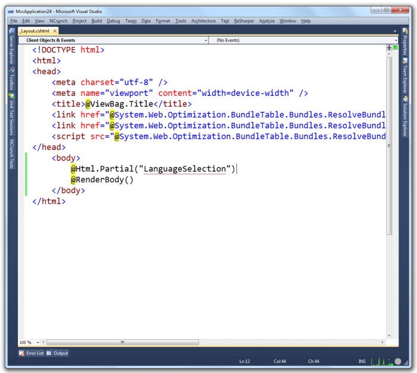
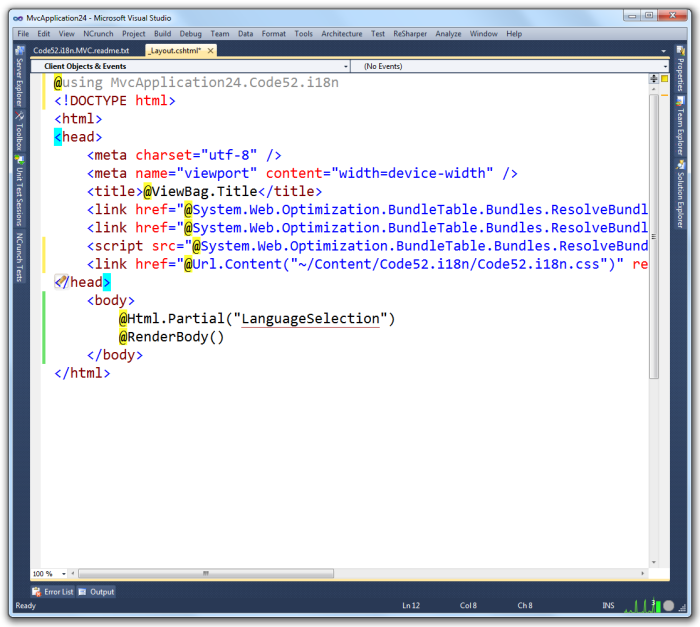
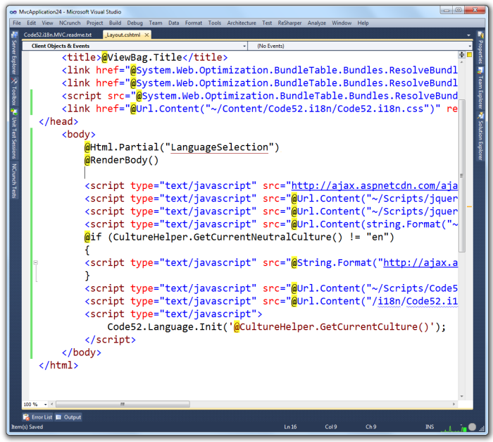

&lt;div id="screenshot" style="float:right">
	&lt;img src="logo-small.png" alt="{{ site.appname }}" />
	&lt;div style="clear:both">&nbsp;&lt;/div>
&lt;/div>

# Add i18n to your site layout (MVC4 Razor example)

We are going to modify the vanilla ```_Layout.cshtml``` file that comes with MVC 4 for this example, so your experience may vary.

## Add the language selector

Insert this statement into your layout file:

    @Html.Partial("LanguageSelection")



## Add the namespace

Insert this using statement at the top of the layout file:

    using $rootnamespace$.Code52.i18n

This namespace contains the CultureHelper class which exposes a set of functionality for managing culture within the application.


## Add the stylesheet

To get the styles right for your language selector, add this CSS statement into the head of the layout page:

    &lt;link href="@Url.Content("~/Content/Code52.i18n/Code52.i18n.css")" rel="stylesheet" type="text/css" /&gt;



## Add the scripts

Lastly, a series of scripts is required to manage the localization behaviour in the browser. Add this snippet to the bottom of your page, just inside the closing &lt;/body&gt; tag:

    &lt;script type="text/javascript" src="http://ajax.aspnetcdn.com/ajax/jquery.validate/1.9/jquery.validate.min.js"&gt;&lt;/script&gt;
    &lt;script type="text/javascript" src="@Url.Content("~/Scripts/jquery.globalize/globalize.js")"&gt;&lt;/script&gt;
    &lt;script type="text/javascript" src="@Url.Content("~/Scripts/jquery.cookie.js")"&gt;&lt;/script&gt;
    &lt;script type="text/javascript" 
        src="@Url.Content(string.Format("~/Scripts/jquery.globalize/cultures/globalize.culture.{0}.js", CultureHelper.GetCurrentCulture()))"&gt;&lt;/script&gt;
    @if (CultureHelper.GetCurrentNeutralCulture() != "en")
    {
	&lt;script type="text/javascript" 
	    src="@String.Format("http://ajax.aspnetcdn.com/ajax/jquery.validate/1.9/localization/messages_{0}.js", CultureHelper.GetCurrentNeutralCulture())"&gt;&lt;/script&gt;    
	}
    &lt;script type="text/javascript" src="@Url.Content("~/Scripts/Code52.i18n.js")"&gt;&lt;/script&gt;
    &lt;script type="text/javascript" src="@Url.Content("/i18n/Code52.i18n.language.js")"&gt;&lt;/script&gt;
    &lt;script type="text/javascript"&gt;
        Code52.Language.Init('@CultureHelper.GetCurrentCulture()');    
    &lt;/script&gt;



And that's it.

## Press F5

Run up the application and you should see something relatively simple.


Click on the language in the top-left to view the languages available for the site.


Click on a language to select it. This will reload the browser and change the culture for the application.


How easy was that?
