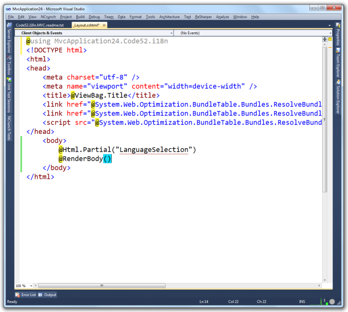
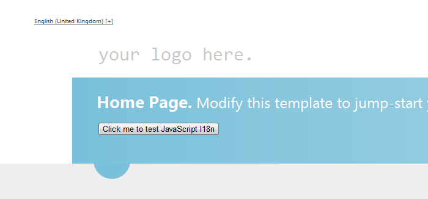

<div id="screenshot" style="float:right">
	
	<div style="clear:both">&nbsp;</div>
</div>

# Add i18n to your site (Razor example)

This guide modifies the vanilla ```_Layout.cshtml``` file that is created in MVC 4 - what you see might be different but the steps remain the same.

## Add the language selector

Insert this statement into your layout file:

    @Html.Partial("LanguageSelection")


## Add the namespace

Insert this using statement at the top of the layout file:

    using $rootnamespace$.Code52.i18n

This namespace contains the CultureHelper class which exposes a set of functionality for managing culture within the application.



## Add the stylesheet

To get the styles right for your language selector, add this CSS statement inside the ```<head>``` node on the layout page:

    <link href="@Url.Content("~/Content/Code52.i18n/Code52.i18n.css")" rel="stylesheet" type="text/css" />


## Add the scripts

Finally, a set of JS files need to be referenced to manage the localization behaviour in the browser. 

Add this snippet to the bottom of your page, just inside the closing ```</body>``` tag:

    <script type="text/javascript" src="http://ajax.aspnetcdn.com/ajax/jquery.validate/1.9/jquery.validate.min.js"></script>
    <script type="text/javascript" src="@Url.Content("~/Scripts/jquery.globalize/globalize.js")"></script>
    <script type="text/javascript" src="@Url.Content("~/Scripts/jquery.cookie.js")"></script>
    <script type="text/javascript" 
        src="@Url.Content(string.Format("~/Scripts/jquery.globalize/cultures/globalize.culture.{0}.js", CultureHelper.GetCurrentCulture()))"></script>
    @if (CultureHelper.GetCurrentNeutralCulture() != "en")
    {
	<script type="text/javascript" 
	    src="@String.Format("http://ajax.aspnetcdn.com/ajax/jquery.validate/1.9/localization/messages_{0}.js", CultureHelper.GetCurrentNeutralCulture())"></script>    
	}
    <script type="text/javascript" src="@Url.Content("~/Scripts/Code52.i18n.js")"></script>
    <script type="text/javascript" src="@Url.Content("/i18n/Code52.i18n.language.js")"></script>
    <script type="text/javascript">
        Code52.Language.Init('@CultureHelper.GetCurrentCulture()');    
    </script>


## Press F5

Run up the application and you should see something relatively simple.



Clicking on the language in the top-left will slide down the languages selection control - containing the languages supported by the site.


Click a language to select it. This will reload the browser and change the culture for the application.


How easy was that?
