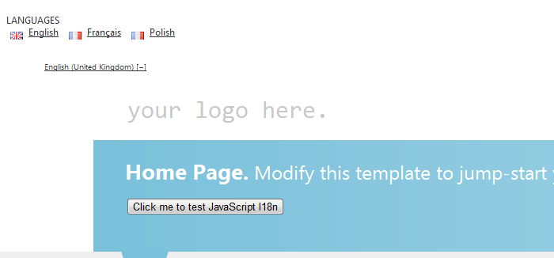

<div id="screenshot" style="float:right">
	
	<div style="clear:both">&nbsp;</div>
</div>

# Add i18n to your site (Razor) from scratch

**Note:** This guide modifies the vanilla ```_Layout.cshtml``` file that is created in MVC 4 - what you see might be different but the steps remain the same.

## Introduction

In this tutorial we will

1. Set up your project

    a) [Install the Code52 i18n package](#add_the_code52i18n_nuget_package)
    
    b) [Create a language resource file](#create_a_language_resource_file)
    
    c)  [Setup the site template](#set_up_the_site_template)
    
2. [Localising text resources](#localising_text_resources)

3. [Language resources for testing](#language_resources_for_testing)

### TL;DR; ? Cheat. use the sample package

We have a sample package which does alot of what's described in this document for you. 
Check out our [getting started page](getting-started).

## 1. Set up your project

### Add the Code52.i18n nuget package

From the package manager console you can type. If you don't have the package manager console visible you can open it via *Tools* > *Library Package Manager* > *Package Manager Console*

<div style="width: 900px">
	<div class="nuget-button-commandWrapper">
		<div class="nuget-button-commandPrompt">
			<p class="nuget-button-command">PM&gt; Install-Package <a href="http://nuget.org/List/Packages/Code52.i18n.MVC4">Code52.i18n.MVC4</a></p>
		</div>
	</div>
</div>

### Create a language resource file

**Note:** If you already have a resource file that you want to use for your language text then feel free to skip this section.

Add a new resource file to host your language text. We would recommend creating a resource file specifically for the purpose of languages.


For the purpose of this tutorial we will be creating the language resource file within the web project. This however does not have to be the case. If you create the resource in a project other than the one that hosts your controllers then just be sure to set the resource access modifier to public.


### Set up the site template

Insert this statement into your layout file:

    @Html.Partial("LanguageSelection")


### Add the namespace

Insert a using statement at the top of the layout file to point to the Code52 i18n code. This code is installed by default in a directory called Code52.i18n within the root of your web application :

`using $rootnamespace$.Code52.i18n`
    
for example;
    
`    using MyWebApp.Code52.i18n`

This namespace contains the CultureHelper class which exposes a set of functionality for managing culture within the application.


### Add the stylesheet

To get the styles right for your language selector, add this CSS statement inside the ```<head>``` node on the layout page:

    <link href="@Url.Content("~/Content/Code52.i18n/Code52.i18n.css")" rel="stylesheet" type="text/css" />


### Add the scripts

Finally, a set of JS files need to be referenced to manage the localization behaviour in the browser. 

Add this snippet to the bottom of your page, just inside the closing ```</body>``` tag:

    <script type="text/javascript" src="http://ajax.aspnetcdn.com/ajax/jquery.validate/1.9/jquery.validate.min.js"></script>
    <script type="text/javascript" src="@Url.Content("~/Scripts/jquery.globalize/globalize.js")"></script>
    <script type="text/javascript" src="@Url.Content("~/Scripts/jquery.cookie.js")"></script>
    <script type="text/javascript" 
        src="@Url.Content(string.Format("~/Scripts/jquery.globalize/cultures/globalize.culture.{0}.js", CultureHelper.GetCurrentCulture()))"></script>
    @if (CultureHelper.GetCurrentNeutralCulture() != "en")
    {
	<script type="text/javascript" 
	    src="@String.Format("http://ajax.aspnetcdn.com/ajax/jquery.validate/1.9/localization/messages_{0}.js", CultureHelper.GetCurrentNeutralCulture())"></script>    
	}
    <script type="text/javascript" src="@Url.Content("~/Scripts/Code52.i18n.js")"></script>
    <script type="text/javascript" src="@Url.Content("/i18n/Code52.i18n.language.js")"></script>
    <script type="text/javascript">
        Code52.Language.Init('@CultureHelper.GetCurrentCulture()');    
    </script>


What we are doing here is loading in the a number of JavaScript libraries, their localised counterparts and language resources.

Specifically we are loading in
	
* jQuery Validate 
* jQuery Globalise
* Code52 i18n

This line 

    <script type="text/javascript" src="@Url.Content("~/Scripts/Code52.i18n.js")"></script>

loads in the Code52 i18n script file that initialises both the UI elements and the jQuery Globalise library. This is followed up by a reference not to a javascript file but to a MVC registered route. 

    <script type="text/javascript" src="@Url.Content("/i18n/Code52.i18n.language.js")"></script>

This route generates a resource that exposes your Language resource file to JavaScript. More on this later.

### Sample web page

For the purpose of this demonstration, my home\index.cshtml looks like as follows;

    @{
        ViewBag.Title = "Home Page";
    }
    
    @section featured {
    <section class="featured">
        <div class="content-wrapper">
            <hgroup class="title">
                <h1>@ViewBag.Title.</h1>
                <h2>@ViewBag.Message</h2>
            </hgroup>
            <p>
               <button id="samplebutton">Click me to test JavaScript l18n</button>
            </p>
        </div>
    </section>
    }
    
    <script type="text/javascript">
    $(document).ready(function () {
        $('#testButton').click(
               function () {
                   alert(Code52.Language.Dictionary.Demonstration_Alert);
                   return false;
               }
            );
    });        
    </script>
    
### Press F5

Run up the application and you should see something relatively simple.


Clicking on the language in the top-left will slide down the languages selection control - containing the languages supported by the site.



Click a language to select it. This will reload the browser and change the culture for the application. 


How easy was that?... Yeah ok, It doesn't look like much has happened but it has ! I promise. No text  jas changed at this point because we have not localised any of the language resources, so let's get onto that now. 

## Localising Text Resources

We will now discuss adding text entries into your resource files.

**Adding localised text entries**

When adding text entries into your resource file you should pay particular attention to providing some detailed information on what the text you are entering means, and in what context. Why? Well this information will help you and anyone who is translating the text into another language - and understanding the meaning and context of a word is important when it comes to translation.

### Adding Resource Entries

So let's add a new text entry called **Demonstration_Alert** into our language resource file.

1. Open the language resource file.
2. Enter **Demonstration_Alert** into the name field
3. Enter **This is my alert text coming from my resource file** into the value field
4. Type a description of what this entry means into the Comment field. Such as "An alert message displayed in a browser alert dialog"

### Referencing Language Resource entries in code

#### From .NET

You can reference a language entry from VB or CSharp by simply referencing the Language resource file like this;

    public ActionResult Index() {
        // This is what existed before...
        // ViewBag.Message = "Modify this template to jump-start your ASP.NET MVC application.";
        // This is us getting the same value out of the Language resource file instead
        ViewBag.Message = Language.Index_Title;
        return View();
    }

#### From JavaScript

Accessing your language entries from JavaScript is childsplay thanks to the */i18n/Code52.i18n.language.js* 'script' you referenced earlier. By calling this you instantly have all the language resources available to your JavaScript code for the current user-culture.

You reference entries through a statement like;

    alert(Code52.Language.Dictionary.Index_Title);

## Adding other languages

### Method 1 - Manual

So you can create a specific language resource file by simply creating another resource file with the same name of your existing resource file + the ISO code of the culture you wish it to represent. For example. If your 'root' language resource file is called Language.resx. A french version would be called Language.fr.resx. 
Further to this, if you want to further specify the language and culture of the resource, such as English (American) then you would call the resource file Language.en-US.resx.

### Method 2 - Better :)

The manual process is really quite painful. Thankfully there is a solution, and that is called [**Zeta Resource Editor**](http://www.zeta-resource-editor.com/index.html). This is a free application that frankly is a must have for anyone working on a localisation project.

Instructions on how to use Zeta is a tutorial in it's own right, but for now it is suffice to say that you can create a project in Zeta (even import your Visual Studio solution). Specify what language your 'base' resource is, and then generate whatever languages you wish off the back of your base language resource - **most awesome indeed**

### Demo

So now that we have created another language file (in my case a French resource) using one of the two aforementioned methods, when we compile then view the web page we should see the following


## Language resources for testing

Knowing what text in a site has been localisation and what has not can become very tricky, very quickly. Believe me. So what can we do to help this ? Well it's really quite simple. We can utilise a very handy little utility called **Psuedoizer** to generate a 'mock' localised language resource for us. 

What this tool allows us to do is create another language resource file based on our 'base' resource file. It generates readable but obviously 'mock' exaggerations of the text within our source resource file.

First we need to install the Code52 i18n powershell commandlet. This is contained within an optional NuGet package


<div style="width: 900px">
	<div class="nuget-button-commandWrapper">
		<div class="nuget-button-commandPrompt">
			<p class="nuget-button-command">PM&gt; Install-Package <a href="http://nuget.org/List/Packages/Code52.i18n.Tools">Code52.i18n.Tools</a></p>
		</div>
	</div>
</div>

Once installed we can generate our test resource file using the Code52-Psuedoizer module

    Code52-Psuedoizer -InputResourceFile -OutputResourceFile

For example;

    Code52-Psuedoizer -InputResourceFile I:\Projects\MVC4\Resources\Language.resx -OutputResourceFile I:\Projects\MVC4\Resources\Language.pl.resx

This command takes in the Language.resx, and outputs a generated resource file called Language.pl.resx. Refer to 

Here is an example of what I mean;

**English**
"Modify this template to jump-start your ASP.NET application"

**Psuedoized**
"[Mőđįƒy ŧĥįş ŧęmpľäŧę ŧő ĵūmp-şŧäřŧ yőūř ÅŜP.ŃĒŦ äppľįčäŧįőʼn !!! !!! !!!]"

